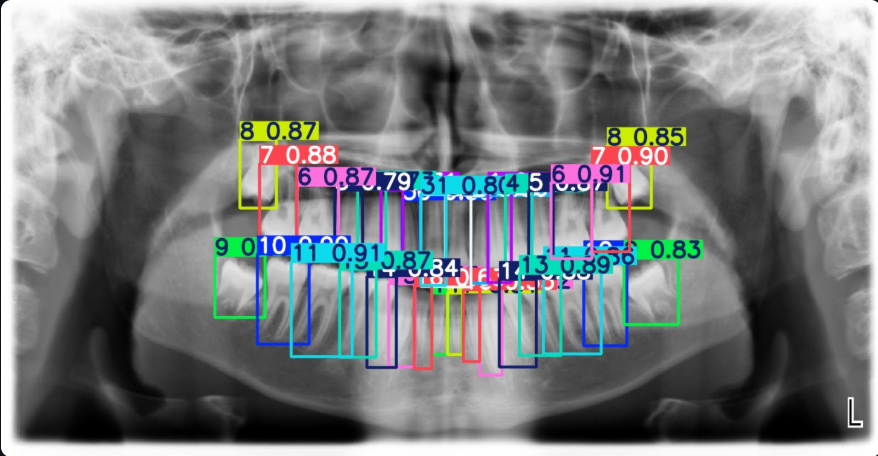
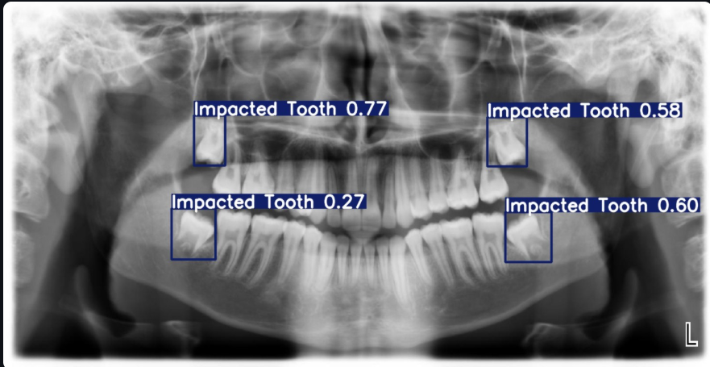
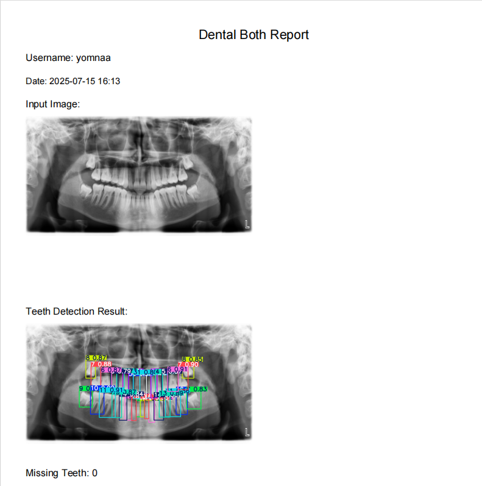
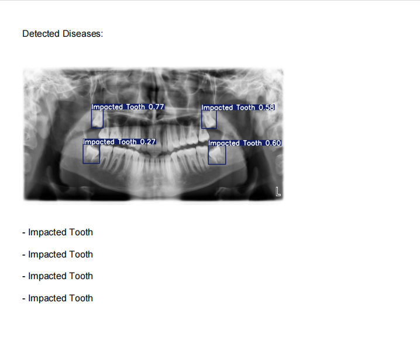

# 🦷 Dental X-ray Diagnosis System

This is a deep learning-based dental diagnosis web application built with **YOLOv8**, **Streamlit**, and a local **SQLite database**. It detects individual teeth and dental diseases from panoramic X-ray images and provides users with a downloadable PDF report.

---

## 📌 Features

- **Teeth Detection**  
  Custom YOLOv8 model to detect and label individual teeth.

- **Disease Detection**  
  Second YOLOv8 model identifies dental conditions such as *Amalgam filling*, *Composite filling*, *crown*, and *Implant*.

- **Combined Detection Mode**  
  Runs both models and shows a combined annotated output.

- **Image Upload**  
  Users can upload their own panoramic dental X-rays.

- **PDF Report Generation**  
  Includes results, stats, and visualizations from the models.

- **Diagnosis History**  
  Logged-in users can access their full history saved in a local database.

- **Login/Signup System**  
  Secure user authentication through Streamlit.

---

## 🖼️ Sample Results

### 🦷 Teeth Detection  

### ❗ Disease Detection  

### 🧾 PDF Report Sample  
  

---

## 📂 Project Structure
